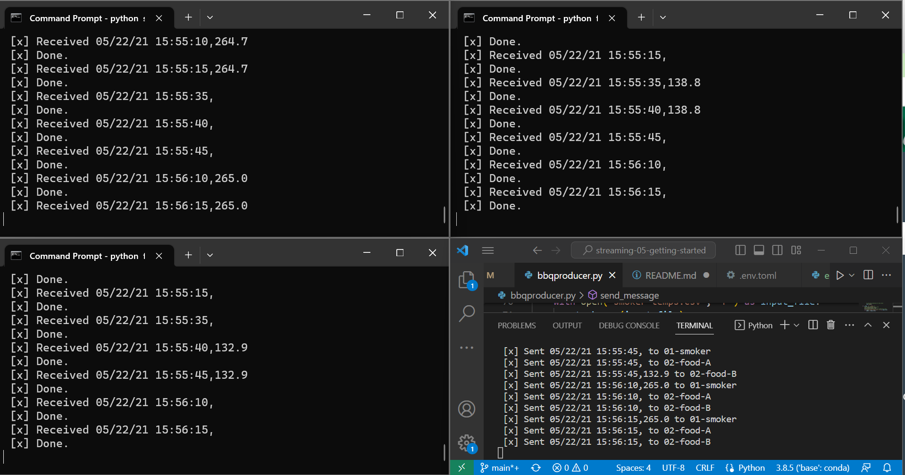
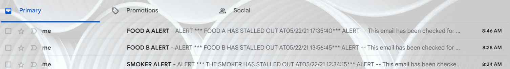
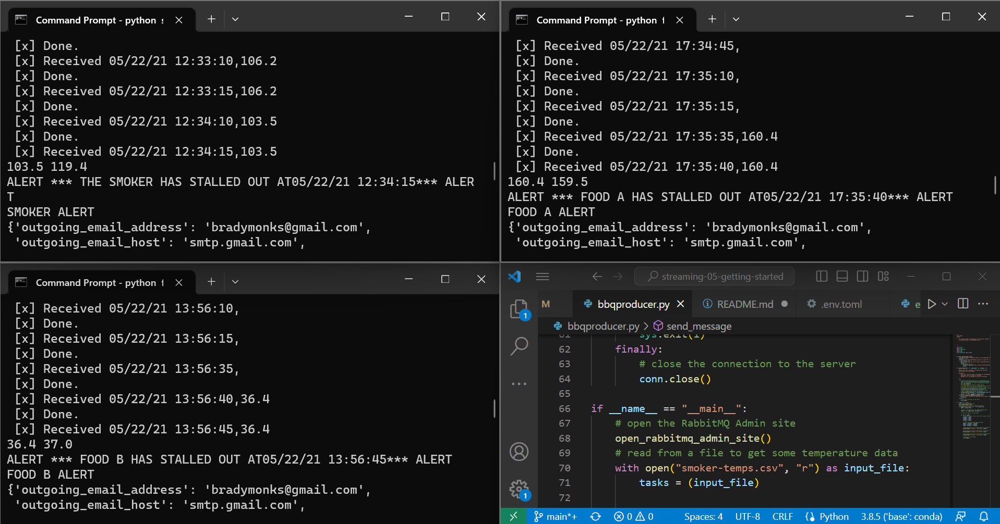

# streaming-05-getting-started

This is a culmination of the last few weeks of our course learning about producers and consumers. 

# Problems

The thing that caused me the most troubleshooting issues was incorporating the Email alert into the consumer. Instead of tomllib, I was required to import the module tomli, and once that was done, the sailing was much smoother. 

# Process

I went with three separate consumers. From there, I added little by little to each. I started with just receiving the temperature, then I sent the time with the temperature so that I could apply the time stamp to the alert. Once I was able to send the proper alerts back to the producer with the correct timestamp, I started working on the email alerts. Like I said, I was struggling to get the tomllib module imported until I found that it might be under a different name. I copied the function into each consumer and triggered it whenever the food/smoker stalled out. For the sake of time, I set sleep to (1) so that I could code more efficiently and troubleshoot quicker. 

# Screenshots

Like I've done the past couple weeks, I set up my producer in VS Code, while I have each of the consumers running in Command Prompt. I was using Anaconda Prompt for my consumers, however I ran into a little trouble upgrading Python there to 3.11, and ended up downloading 3.11 from Python's website straight to my machine. 

After tinkering with the code forever, I finally got the desired outcome and was able to get the emails sent out with the alerts!

Each of my consumer scripts had it written in to return the first and last inputs of the deque's so that we can see what the problem was, along with a message that has the timestamp. 